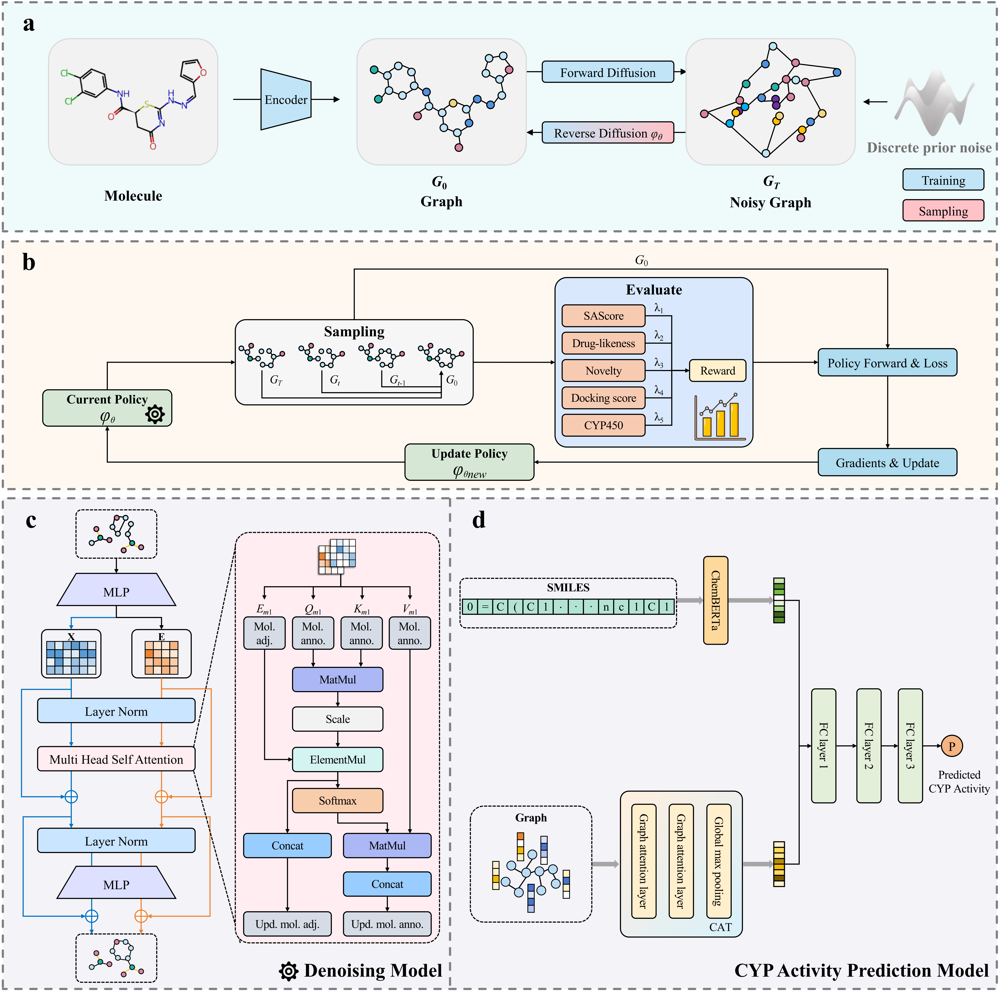

This repository contains the code and data for our paper "[**DiffMeta-RL: Reinforcement Learning-Guided Graph Diffusion for Metabolically Stable Molecular Generation**]". Currently, the paper is under review. We plan to make the code publicly available after the paper is accepted.  ！！！


# DiffMeta-RL

**DiffMeta-RL: Reinforcement Learning-Guided Graph Diffusion for Metabolically Stable Molecular Generation**


## Model Architecture of DiffMeta-RL

<p align="center">
  
</p>


## News!

Submit

## Environment Setup

We recommend using Anaconda or Miniconda to manage your Python environment.

### 1. Create and activate a new Conda environment

```bash
conda create -n DiffMeta python=3.9 -y
conda activate DiffMeta
```


### 2. Create and activate a new Conda environment

Make sure you are in the root directory of the repository, then run:

```bash
pip install -r requirements.txt
```


## Data


Before training, ensure that datasets (e.g., MOSES, ChEMBL, GuacaMol) are downloaded and preprocessed.


- **[MOSES](https://github.com/molecularsets/moses)**: A benchmarking platform for molecular generation models. You can clone the repository and extract SMILES data from the `/data` folder, place them under `dataset/moses/`.

- **[GuacaMol](https://github.com/BenevolentAI/guacamol)**: A benchmark suite for goal-directed molecular generation. Download the datasets and place them under `dataset/guacamol/`.

- **[ChEMBL v35](https://drive.google.com/drive/folders/15k0v46YiSRE-Cs7aTBgwbB_uh4UTXEbN?usp=drive_link)**: Our customized dataset based on ChEMBL. Download the provided files and place them under `dataset/chembl/`.


## Running

The training process in **DiffMeta-RL** consists of two sequential stages:

### Stage 1: Pretraining with Discrete Graph Diffusion

We first pretrain the model on a large molecular dataset (e.g., MOSES or ChEMBL) using discrete denoising diffusion to learn the underlying molecular graph distribution.

```bash
# Example: Pretraining on ChEMBL
python main_generate.py +experiment=chembl.yaml

# Or pretraining on MOSES
python main_generate.py +experiment=moses.yaml
```
>You can also directly download our pretrained diffusion models (trained on ChEMBL and MOSES) from the following link and place them under ./pretrained/: [https://drive.google.com/drive/folders/1J1_r7mf3-SyEqgtl1pv5Bu4r6zmZlbPl?usp=drive_link]

### Stage 2: Fine-tuning with Reinforcement Learning 

After pretraining, we apply RL to fine-tune the model towards task-specific objectives (e.g., QED, SA, docking scores, or metabolic stability).

```bash

bash run_ppo_chembl.sh

```

> 🔧 **Note**: You can replace or add receptor `.pdbqt` files to evaluate docking against different protein targets under `scorer/receptors/`.  
> Make sure to update both the **experiment YAMLs** and the **docking parameters in `vinadock.py`** accordingly.


## License
Code is released under MIT LICENSE.


## Cite:


